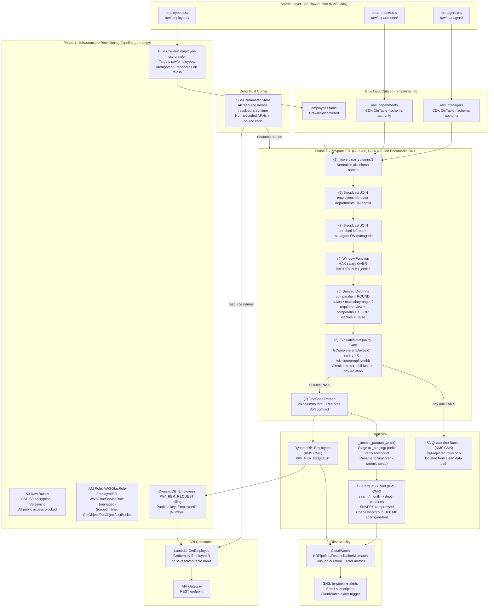

# aws-glue-demo - HR Analytics ETL Pipeline

HR compensation data typically lives across disconnected spreadsheets - raw employee records, salary bands, and manager hierarchies that nobody has joined together. This pipeline ingests those three CSV sources, enriches them with computed fields (compa-ratio, salary band position, manager activity flags), and serves the result two ways: a low-latency Lambda API for individual lookups and a partitioned Parquet data lake for Athena analytics.

Built with AWS CDK (Python), PySpark on Glue 4.0, and a deliberate focus on making every infrastructure decision auditable and cost-justified.

---

## What was verified in production

- **542 Parquet partition files** written to S3 (`year/month/dept`) - confirmed via AWS CLI audit
- **0 records with Salary <= 0** reached DynamoDB - `EvaluateDataQuality` circuit breaker confirmed effective across 1,000 scanned items
- **100 MB Athena scan guardrail** enforced at workgroup level, cannot be overridden per session
- **Zero hardcoded resource names** in source code - all config fetched from SSM at runtime

See [VERIFICATION.md](VERIFICATION.md) for the full CLI audit trail and the three production bugs that were root-caused and fixed during the build.

---

## Architecture

### Pipeline Overview


### Data Access - KMS Encryption & SSM Zero-Trust Config


### End-to-End Architecture



### Data Model - Transform Steps

| Step | Operation | Output columns added |
|---|---|---|
| (1) lowercase | Normalise all headers | - |
| (2) JOIN departments | Left-outer on `deptid` | `departmentname · maxsalaryrange · minsalaryrange · budget` |
| (3) JOIN managers | Left-outer on `managerid` | `managername · isactive · level` |
| (4) Window | MAX salary OVER jobtitle | `highesttitlesalary` |
| (5) Derived | Arithmetic + boolean | `comparatio · requiresreview` |
| (6) DQ gate | Circuit breaker | - (quarantine bad rows) |
| (7) TitleCase | API contract remap | 24 final columns |

---

## Deep dives

| Topic | What's covered |
|---|---|
| [FinOps Strategy](docs/FINOPS.md) | Worker sizing, retry policy, Athena cost controls, why MaxRetries=0 is the right call |
| [Security](docs/SECURITY.md) | KMS encryption, SSM Zero-Trust config, IAM least-privilege statement-by-statement |
| [Data Quality & Governance](docs/DATA-QUALITY.md) | Two-tier DQ strategy, circuit breaker, what the CloudWatch alarm does and doesn't catch |
| [Athena Queries](docs/ATHENA-QUERIES.md) | Business-oriented queries with partition-aware patterns |
| [ADR 001 - Configuration Management](docs/ADR/001-configuration-management.md) | Why SSM over environment variables |

---

## Prerequisites

- AWS CLI configured (`aws configure`)
- Node.js >= 18
- Python >= 3.10
- `jq` (`brew install jq`)

---

## Deploy

```bash
bash deploy.sh
```

Steps performed automatically:
1. Install CDK CLI (if missing)
2. Install Python CDK dependencies
3. Bootstrap CDK in `us-east-1`
4. Deploy the CloudFormation stack (S3, Glue, DynamoDB, Lambda, KMS, SSM, CloudWatch, SNS)
5. Upload the 3 CSVs to the raw S3 bucket
6. Start the Glue ETL job

Monitor the Glue job (3-5 min):
```bash
aws glue get-job-run \
  --job-name $(jq -r '.HrPipelineStack.GlueJobName' outputs.json) \
  --run-id <run-id-from-deploy-output> \
  --region us-east-1 \
  --query 'JobRun.JobRunState'
```

---

## Verify

```bash
bash verify_api.sh           # employee 1001 (default)
bash verify_api.sh 1042      # any employee ID
```

Expected response:
```json
{
  "EmployeeID": "1001",
  "Name": "Patricia Martinez",
  "Department": "Sales",
  "JobTitle": "Sales AE",
  "Manager": "Jennifer Jones",
  "Salary": 121131.0,
  "CompaRatio": 0.79,
  "HighestTitleSalary": 139838.0,
  "RequiresReview": false
}
```

---

## Tests

```bash
# Lambda handler (no AWS required)
pytest tests/unit/test_handler.py -v

# E2E (requires deployed stack + completed Glue job)
pytest tests/e2e/ -v -m e2e
```

---

## Teardown

```bash
cdk destroy HrPipelineStack
```

All resources have `REMOVAL_POLICY.DESTROY`. The KMS key enters a 7-day scheduled deletion window after stack destroy.

---

## Project Structure

```
aws-glue-demo/
├── data/
│   ├── employee_data_updated.csv
│   ├── departments_data.csv
│   └── managers_data.csv
├── docs/
│   ├── ADR/
│   │   └── 001-configuration-management.md
│   ├── images/
│   │   ├── workflow.png
│   │   └── data-access.png
│   ├── FINOPS.md
│   ├── SECURITY.md
│   ├── DATA-QUALITY.md
│   └── ATHENA-QUERIES.md
├── infrastructure/
│   ├── app.py
│   ├── infrastructure_stack.py
│   └── requirements.txt
├── src/
│   ├── glue/
│   │   └── etl_job.py
│   └── lambda/
│       └── handler.py
├── tests/
│   ├── unit/
│   │   └── test_handler.py
│   └── e2e/
│       └── test_pipeline_e2e.py
├── README.md
├── VERIFICATION.md
├── deploy.sh
└── verify_api.sh
```
