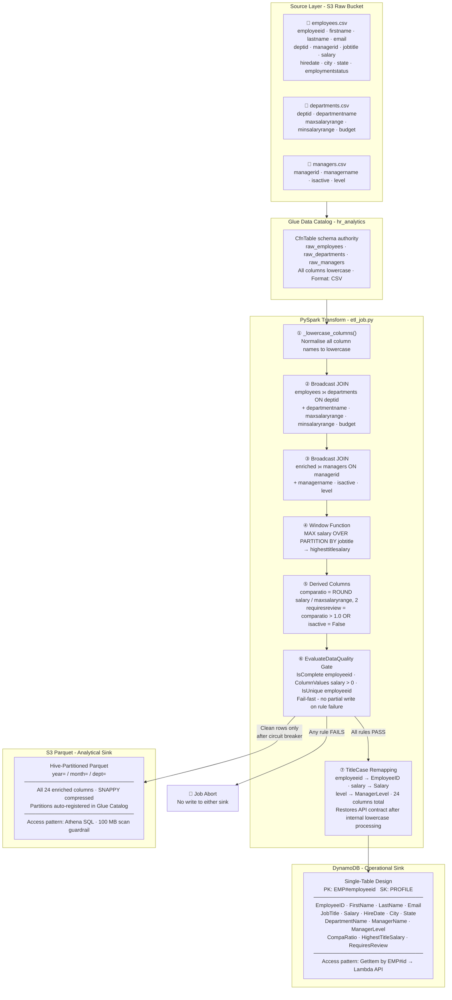

# aws-glue-demo - Serverless HR Analytics ETL Pipeline

A production-grade, serverless ETL pipeline on AWS demonstrating Zero-Trust configuration, FinOps cost controls, observability, and data governance - built with AWS CDK (Python), PySpark, and AWS Glue 4.0.

---

## Highlights

- **542 Parquet partition files** written to S3 (`year/month/dept`) - verified via AWS CLI audit
- **0 records with Salary ≤ 0** in DynamoDB - `EvaluateDataQuality` Circuit Breaker confirmed effective
- **100 MB Athena scan guardrail** enforced at workgroup level (`EnforceWorkGroupConfiguration: true`)
- **Zero-Trust config** - no ARN, bucket name, or secret in source code; all via SSM Parameter Store
- **Customer-Managed KMS** encryption on all S3 buckets and DynamoDB; annual key rotation enabled
- **IAM least-privilege** - every statement scoped to a specific resource ARN or prefix; no `Resource: "*"`
- **SNS alerting mesh** - `cloudwatch.amazonaws.com` principal authorized in resource policy; fires within 1 min of failure
- **Static Glue Catalog** (CDK `CfnTable`) - no Crawler DPU spend; schema authority lives in code
- **G.1X × 2 workers, MaxRetries=0, Timeout=5 min** - FinOps guardrails against runaway DPU spend

---

## Architecture

### Pipeline Overview


### Data Access - KMS Encryption & SSM Zero-Trust Config


---

### Data Model - Raw CSV to Dual Sink



---

## FinOps Strategy

Cost was a first-class design constraint. Every decision has a price tag.

| Decision | Rationale | Monthly savings vs. default |
|---|---|---|
| **G.1X workers (2×)** | Minimum viable worker size for batch PySpark ETL. G.2X doubles DPU cost with no throughput benefit at 1,000-row scale. | ~$0.11/run |
| **`MaxRetries = 0`** | Runaway retries on a misconfigured job would silently double or triple DPU spend. Fail fast; alert; fix. | Up to 2× DPU savings |
| **`Timeout = 5 min`** | Hard kill at 5 minutes prevents a hung Spark stage from accumulating DPU-hours. | Unbounded protection |
| **Athena 100 MB scan cap** | `BytesScannedCutoffPerQuery = 104857600` on `hr_analytics_wg`. Ad-hoc queries against the wrong (unpartitioned) table cannot scan the full dataset. | Depends on query; cap prevents surprises |
| **Hive partitioning (year/month/dept)** | Athena prunes partitions at query time. A query scoped to one department and one month reads ~1/72 of the dataset. | Up to 98% Athena cost reduction |
| **Static Glue Catalog (no Crawler)** | Crawlers run on a schedule, consume DPUs, and cost ~$0.44/hour. Schema authority lives in CDK `CfnTable` definitions - free at synth time. | ~$0.44/crawl eliminated |
| **CloudWatch Alarm (~$0.10/month)** | Early detection prevents a silent pipeline failure from persisting for days, which would require a costly backfill run. | Pays for itself on first incident |

---

## Security

### Encryption at rest and in transit

All S3 buckets are encrypted with a **Customer-Managed KMS Key** (annual rotation enabled). DynamoDB uses AWS-managed KMS:

| Resource | Encryption |
|---|---|
| S3 raw bucket | SSE-KMS (pipeline key) |
| S3 Parquet bucket | SSE-KMS (pipeline key) |
| S3 assets bucket (Glue TempDir) | SSE-KMS (pipeline key) |
| DynamoDB single-table | AWS-managed KMS (`TableEncryption.AWS_MANAGED`) |

### Zero-Trust configuration discovery

No resource name, ARN, or secret appears in source code or in environment variables. All runtime configuration is fetched from **SSM Parameter Store** at startup:

| SSM Path | Consumer | Purpose |
|---|---|---|
| `/hr-pipeline/dynamodb-table-name` | Glue ETL, Lambda | DynamoDB table for sink and read API |
| `/hr-pipeline/parquet-bucket-name` | Glue ETL | S3 output path for Parquet sink |
| `/hr-pipeline/raw-bucket-name` | Ops runbooks | Raw CSV source bucket |
| `/hr-pipeline/kms-key-arn` | Audit tooling | KMS key for encryption verification |

See [docs/ADR/001-configuration-management.md](docs/ADR/001-configuration-management.md) for the full decision record.

### IAM least-privilege

No `Resource: "*"` exists in any custom IAM statement.

| Principal | Actions | Scoped to |
|---|---|---|
| Glue job role | `s3:GetObject`, `s3:ListBucket` | `raw_bucket/raw/*` prefix only |
| Glue job role | `s3:PutObject`, `s3:DeleteObject` | `parquet_bucket/employees*` prefix |
| Glue job role | `s3:GetObject`, `s3:PutObject`, `s3:DeleteObject`, `s3:ListBucket` | `assets_bucket/*` (TempDir + script) |
| Glue job role | `dynamodb:DescribeTable`, `dynamodb:PutItem`, `dynamodb:BatchWriteItem` | `aws-glue-demo-single-table` only |
| Glue job role | `kms:GenerateDataKey*`, `kms:Decrypt` | Specific pipeline KMS key ARN |
| Glue job role | `ssm:GetParameter`, `ssm:GetParameters` | `/hr-pipeline/*` prefix |
| Glue job role | `glue:GetTable`, `glue:BatchCreatePartition`, `glue:UpdateTable` | `hr_analytics` DB + `employees` table only |
| Lambda role | `dynamodb:GetItem` | `aws-glue-demo-single-table` only |
| Lambda role | `ssm:GetParameter` | `/hr-pipeline/dynamodb-table-name` only |

---

## Data Quality & Governance

The pipeline enforces a two-tier quality strategy:

**Tier 1 - Rule-level gate (fail-fast):**
`EvaluateDataQuality` checks three rules before any write. A single failure aborts the job - no partial data reaches DynamoDB or Parquet.

```
IsComplete "employeeid"
ColumnValues "salary" > 0
IsUnique "employeeid"
```

**Tier 2 - Row-level circuit breaker:**
Even when aggregate rules pass, individual rows with a `RowOutcome=Error` (null `EmployeeID` or non-positive `Salary`) are quarantined. They are logged to CloudWatch (`/aws-glue/jobs/output`) and excluded from the DynamoDB write. Clean records proceed normally.

---

## Observability

| Signal | Implementation |
|---|---|
| **CloudWatch Dashboard** `hr-pipeline-observability` | Glue succeeded/failed task counts + Athena bytes scanned per query |
| **CloudWatch Alarm** `hr-pipeline-glue-job-failed` | Fires within 1 minute when `numFailedTasks > 0` |
| **SNS Topic** `hr-pipeline-alerts` | Alarm action target - subscribe an email or PagerDuty endpoint to receive alerts |
| **Glue DQ Results** | Published to the Glue Data Quality console under context `hr_etl_dq` |
| **CloudWatch Logs** `/aws-glue/jobs/output` | Circuit breaker quarantine logs (1-day retention) |

---

## Single-Table Design

All employee records live in one DynamoDB table with a composite key:

| Attribute | Value |
|---|---|
| `PK` | `EMP#<EmployeeID>` |
| `SK` | `PROFILE` |

**Key computed fields:**

| Field | Formula |
|---|---|
| `CompaRatio` | `ROUND(Salary / MaxSalaryRange, 2)` |
| `HighestTitleSalary` | `MAX(Salary) OVER (PARTITION BY JobTitle)` |
| `RequiresReview` | `CompaRatio > 1.0 OR IsActive == "False"` |

---

## Source Data

| File | Rows | Key Fields |
|---|---|---|
| `employee_data_updated.csv` | 1,000 | EmployeeID, DeptID, ManagerID, Salary |
| `departments_data.csv` | 6 | DeptID, MaxSalaryRange, MinSalaryRange, Budget |
| `managers_data.csv` | 100 | ManagerID, IsActive, Level |

---

## Prerequisites

- AWS CLI configured (`aws configure`)
- Node.js >= 18
- Python >= 3.10
- `jq` (`brew install jq`)

---

## Deploy

```bash
bash deploy.sh
```

Steps performed automatically:
1. Install CDK CLI (if missing)
2. Install Python CDK dependencies
3. Bootstrap CDK in `us-east-1`
4. Deploy the CloudFormation stack (S3, Glue, DynamoDB, Lambda, KMS, SSM, CloudWatch, SNS)
5. Upload the 3 CSVs to the raw S3 bucket
6. Start the Glue ETL job

Monitor the Glue job (~3–5 min):
```bash
aws glue get-job-run \
  --job-name $(jq -r '.HrPipelineStack.GlueJobName' outputs.json) \
  --run-id <run-id-from-deploy-output> \
  --region us-east-1 \
  --query 'JobRun.JobRunState'
```

---

## Verify

```bash
bash verify_api.sh           # employee 1001 (default)
bash verify_api.sh 1042      # any employee ID
```

Expected response:
```json
{
  "EmployeeID": "1001",
  "Name": "Patricia Martinez",
  "Department": "Sales",
  "JobTitle": "Sales AE",
  "Manager": "Jennifer Jones",
  "Salary": 121131.0,
  "CompaRatio": 0.79,
  "HighestTitleSalary": 139838.0,
  "RequiresReview": false
}
```

---

## Athena Queries

```sql
-- All employees
SELECT * FROM hr_analytics.employees LIMIT 10;

-- Employees flagged for review
SELECT employeeid, firstname, lastname, jobtitle, comparatio
FROM hr_analytics.employees
WHERE requiresreview = true
ORDER BY comparatio DESC;

-- Average salary by department
SELECT departmentname, ROUND(AVG(salary), 0) AS avg_salary, COUNT(*) AS headcount
FROM hr_analytics.employees
GROUP BY departmentname
ORDER BY avg_salary DESC;

-- Top earners per department
SELECT departmentname, firstname, lastname, salary, comparatio
FROM hr_analytics.employees
WHERE year = 2024
ORDER BY salary DESC
LIMIT 20;
```

---

## Running Tests

```bash
# Lambda handler (no AWS required)
pytest tests/unit/test_handler.py -v

# E2E (requires deployed stack + completed Glue job)
pytest tests/e2e/ -v -m e2e
```

---

## Teardown

```bash
cdk destroy HrPipelineStack
```

All resources have `REMOVAL_POLICY.DESTROY`. The KMS key enters a 7-day scheduled deletion window after stack destroy.

---

## Project Structure

```
aws-glue-demo/
├── data/
│   ├── employee_data_updated.csv
│   ├── departments_data.csv
│   └── managers_data.csv
├── docs/
│   ├── ADR/
│   │   └── 001-configuration-management.md
│   └── images/
│       ├── workflow.png
│       └── data-access.png
├── infrastructure/
│   ├── app.py
│   ├── infrastructure_stack.py
│   └── requirements.txt
├── src/
│   ├── glue/
│   │   └── etl_job.py
│   └── lambda/
│       └── handler.py
├── tests/
│   ├── unit/
│   │   └── test_handler.py
│   └── e2e/
│       └── test_pipeline_e2e.py
├── README.md
├── README_TECHNICAL.md        ← data contract & technical spec
├── deploy.sh
└── verify_api.sh
```
