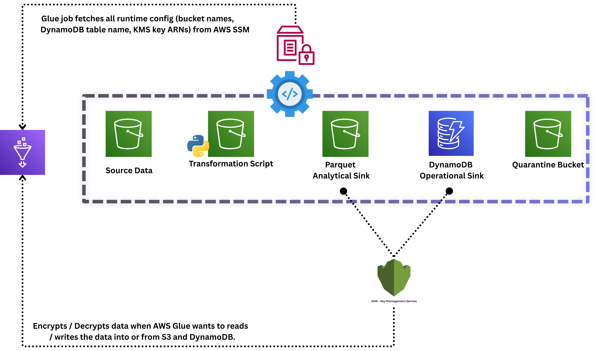

# Technical Design Review — HR Analytics ETL Pipeline

| Field | Value |
|---|---|
| **Author** | Parthiban Rajasekaran |
| **Date** | April 2026 |
| **Status** | Implemented (main branch) |
| **Published** | [Medium — AWS Glue: Production Reliability, FinOps, and UK GDPR Compliance](https://medium.com/@rajasekaran.parthiban7/aws-glue-production-reliability-finops-and-uk-gdpr-compliance-b9bbb11e4a50) |
| **Repository** | [github.com/ParthibanRajasekaran/aws-glue-demo](https://github.com/ParthibanRajasekaran/aws-glue-demo) |

---

## Abstract

HR analytics data is operationally critical and legally sensitive. Raw employee CSV exports arrive in S3 from upstream HR systems — unvalidated, inconsistently typed, and carrying personally identifiable information that cannot reach an analytical sink without pseudonymisation. The pipeline described here transforms those files into two purpose-built sinks: a DynamoDB operational store for sub-millisecond HR API lookups, and a Hive-partitioned Parquet store for cost-efficient Athena analytics. Every rejected record is tagged with a machine-readable reason, quarantined to a write-only S3 bucket, and triggers a CloudWatch alarm within its evaluation period — ensuring any data loss is auditable and alertable before the next reporting cycle. The architecture is implemented on AWS Glue 4.0 (PySpark), CDK-provisioned infrastructure, and a customer-managed KMS key, with UK GDPR (ICO) pseudonymisation applied at the Parquet write boundary.

---

## Section 1 — Problem Statement & Scope

### 1.1 Business Problem

HR compensation analysis requires a daily enriched view of employee records joined with department pay bands and manager status. The raw data lives in CSV files that arrive from HR systems without type contracts: salary fields arrive as strings, department IDs change type across exports, and manager IDs reference managers who have since been marked inactive. Without a structured validation and enrichment layer, analytical queries produce wrong pay-band compliance numbers and compliance reports flag false positives.

Two additional constraints make this non-trivial:

1. **Dual-sink requirement**: Operational consumers (the HR API Lambda) need plain-text PII for authorised lookups. Analytical consumers (Athena) must never see real last names — UK GDPR pseudonymisation is a hard boundary. The same enriched record must be routed to two sinks with incompatible PII requirements.

2. **GDPR compliance**: The ICO's guidance on Article 4(5) pseudonymisation requires that the analytical store contain no data that can be re-linked to an individual without additional information held separately. A partial pseudonymisation — where some partition files are hashed and others are not — constitutes a violation.

### 1.2 System Boundaries

**In scope:**
- S3 raw CSVs → Glue Data Catalog → Glue ETL (G.1X × 2) → DynamoDB + Parquet + Quarantine
- Lambda API consumer reading from DynamoDB (operational queries)
- Athena analytical queries on the Parquet sink via the `hr_analytics_wg` workgroup
- UK GDPR (ICO) pseudonymisation at the Parquet write boundary
- CloudWatch alerting: job failures (1-min), quarantined rows (5-min), reconciliation mismatches (1-hour)

**Not in scope:**
- Real-time streaming (Kinesis/Kafka) — batch-only in this phase
- Right-to-Erasure workflow (Article 17) — scoped as Phase 5
- BI / visualisation layer (Athena → QuickSight)
- Multi-region replication or disaster recovery cross-region failover

### 1.3 Why Two Sinks

The dual-sink design is a direct consequence of the access pattern split:

| Sink | Table / Location | Access Pattern | PII Policy |
|---|---|---|---|
| DynamoDB (`aws-glue-demo-single-table`) | `PK=EMP#id`, `SK=PROFILE` | HR API: `get_item` by employee ID, O(1) | Plain-text — required by business for authorised operational lookups by the HR API |
| Parquet (`s3://{parquet}/employees/year/month/dept/`) | Hive-partitioned, Snappy | Athena: aggregate salary analytics | SHA-256 pseudonymised `lastname` + `email` (UK GDPR Article 4(5)) |

A single sink cannot satisfy both requirements simultaneously. DynamoDB's PAY_PER_REQUEST model and composite key support serve the operational access pattern; Parquet's columnar format and Hive partitioning serve the analytical access pattern. Two sinks with different consistency, latency, and compliance requirements is a data platform problem, not just a script.

---

## Section 2 — Architectural Principles & Trade-offs

### 2.1 Fixed Workers Over Auto-scaling

The Glue job is provisioned with fixed G.1X × 2 workers. Auto-scaling and Flex Execution were both evaluated and rejected.

| Option | Cost/run (upper bound) | Runtime | SLA Defensibility | Chosen? |
|---|---|---|---|---|
| Fixed G.1X × 2 workers | ~$0.044 | ~90s deterministic | High — predictable, debuggable | ✅ |
| Auto-scaling (2–10 workers) | ~$0.02–$0.12 | 60–180s variable | Low — non-deterministic runtime | ❌ |
| Flex Execution (Spot) | ~$0.03 | Fixed + 10-min startup delay | None — no startup SLA | ❌ |

**Cost calculation:** 2 workers × 0.25 DPU-hr × $0.44/DPU-hr = $0.22/DPU-hr-equivalent. At a typical ~6-minute runtime: ~$0.022/run. The $0.044 figure is the upper bound at full 15-minute timeout.

**Quantified trade-off:** The predictability premium over auto-scaling's floor is +$0.014/run. For a morning reporting SLA, the engineering cost of debugging a single non-deterministic Spot interruption exceeds that marginal saving within one incident.

### 2.2 MaxRetries = 0: Fail Fast, Not Silently

`max_retries=0` is the most counterintuitive setting in the job. The instinct is to add retries for resilience. For a batch ETL job with a DQ gate, a retry on bad data does not fix anything — it burns DPUs twice and delays the alert. If the DQ gate failed, the source data is the problem, not the compute. The job is declared FAILED immediately, the CloudWatch alarm fires within 1 minute, and on-call receives an SNS notification before a retry would have even started. Fail fast, fix the data, rerun deliberately.

### 2.3 Timeout = 15 Minutes

`timeout=Duration.minutes(15)` reflects the worst-case execution path: up to 542 server-side `copy_object` calls in Phase 3 of the atomic Parquet write (one per staging file, across all affected partitions). The 15-minute ceiling prevents a hung Spark stage from accumulating DPU-hours indefinitely.

### 2.4 MaxConcurrentRuns = 1

DynamoDB's `PutItem` under the `PAY_PER_REQUEST` model is idempotent but last-write-wins. Two concurrent Glue runs writing to overlapping employee keys would produce non-deterministic results in the operational sink. `MaxConcurrentRuns=1` makes this a structural guarantee rather than an operational convention.

### 2.5 Job Bookmarks + Explicit job.commit()

`--job-bookmark-option: job-bookmark-enable` instructs Glue to record the S3 object keys and byte offsets processed by each `transformation_ctx` per source table. The bookmark only advances when `job.commit()` is called successfully. If the job fails mid-flight — before `job.commit()` — the bookmark does not advance. The next run reprocesses the same S3 files from the same position. This is the at-least-once delivery guarantee: no files are ever silently skipped.

Consequence: both sinks must be idempotent. DynamoDB `PutItem` overwrites are safe; the Parquet atomic swap purges affected partitions before re-writing, preventing double-append.

---

## Section 3 — System Architecture

### 3.1 Workflow Overview


The pipeline is triggered manually or on schedule against the Glue job. Raw CSVs in S3 are read via the Glue Data Catalog (schema authority, no Crawler). The ETL job applies a two-tier DQ gate, enriches records via broadcast joins and window functions, then writes clean rows to DynamoDB and Parquet concurrently. Rejected rows go to the quarantine bucket and trigger the `hr-pipeline-quarantined-rows` alarm. The post-ETL reconciliation script validates row counts and triggers a separate `hr-pipeline-reconciliation-mismatch` alarm if the gap exceeds 5%.

### 3.2 Security & Configuration Architecture



### 3.3 Glue Data Catalog — Contract-First Schema

Schema is authoritative in CDK `CfnTable` definitions. No Glue Crawler is used. This eliminates ~$0.44/crawl DPU cost and prevents Crawler's `inferSchema` from mistyping columns (e.g., inferring `Salary` as string when the CSV has a header row that confuses type detection). Schema drift is caught by the DQ gate, not by a Crawler re-run.

| Table | Location | Format | Partition Keys | Key Columns |
|---|---|---|---|---|
| `raw_employees` | `s3://{raw}/raw/employees/` | CSV | none | EmployeeID(int), Salary(int), DeptID(int), ManagerID(int) |
| `raw_departments` | `s3://{raw}/raw/departments/` | CSV | none | DeptID(int), MaxSalaryRange(int), MinSalaryRange(int), Budget(int) |
| `raw_managers` | `s3://{raw}/raw/managers/` | CSV | none | ManagerID(int), IsActive(string), Level(string) |
| `employees` (output) | `s3://{parquet}/employees/` | Parquet/Snappy | year(int), month(int), dept(string) | 23 enriched columns incl. CompaRatio(double), RequiresReview(boolean), HighestTitleSalary(double) |
| `v_etl_reconciliation` | — | Virtual View | — | `SELECT data_source, COUNT(*) FROM raw_employees UNION ALL employees` |

All CSV tables use `skip.header.line.count: 1` and explicit column types to prevent header-row misreads.

---

## Section 4 — Implementation Details: Glue ETL Job

### 4.1 Column Name Normalisation

The Glue Data Catalog lowercases all column names regardless of the original CSV headers. Mixed-case references after `toDF()` raise `AnalysisException: Column 'XYZ' does not exist` at runtime. The job calls `_lowercase_columns()` immediately after each `from_catalog()` read, renaming all columns to lowercase once, so the rest of the job uses consistent lowercase names throughout.

### 4.2 Type Normalisation (Silver Layer)

Before any join or transformation, all join keys and numeric columns are explicitly cast:

```python
employees = (
    employees.withColumn("deptid",    F.col("deptid").cast("string"))
             .withColumn("managerid", F.col("managerid").cast("string"))
             .withColumn("salary",    F.col("salary").cast("double"))
)
departments = (
    departments.withColumn("deptid",         F.col("deptid").cast("string"))
               .withColumn("maxsalaryrange", F.col("maxsalaryrange").cast("double"))
               .withColumn("minsalaryrange", F.col("minsalaryrange").cast("double"))
)
managers = managers.withColumn("managerid", F.col("managerid").cast("string"))
```

Integer join keys are cast to string to prevent silent type mismatch in left joins (int vs string keys produce a cross-join, not a matched join, in Spark).

### 4.3 Broadcast Joins

`departments` (6 rows) and `managers` (100 rows) are broadcast to all executors via `F.broadcast()`. This eliminates shuffle entirely for both lookup joins, reducing inter-executor data transfer to zero for these operations. The `employees` DataFrame (potentially millions of rows) stays distributed; the small tables are replicated to each executor's memory once.

```python
enriched = employees.join(
    F.broadcast(departments.select("deptid", "departmentname", "maxsalaryrange", "minsalaryrange", "budget")),
    on="deptid",
    how="left",
)
enriched = enriched.join(
    F.broadcast(managers.select("managerid", "managername", "isactive", "level")),
    on="managerid",
    how="left",
)
```

Both joins are `left` — unmatched department or manager rows produce null attributes, not dropped rows. The row-level circuit breaker handles null `comparatio` downstream.

### 4.4 Window Function: HighestTitleSalary

```python
title_window = Window.partitionBy("jobtitle")
enriched = enriched.withColumn(
    "highesttitlesalary",
    F.max(F.col("salary")).over(title_window),
)
```

`HighestTitleSalary` provides a peer-group salary anchor: the maximum salary among all employees with the same job title in this batch. It feeds CompaRatio and enables analytical queries like "what fraction of employees in each title are paid below the peer-group ceiling?"

### 4.5 Business Logic: CompaRatio and RequiresReview

```python
enriched = enriched.withColumn(
    "comparatio",
    F.round(F.col("salary") / F.col("maxsalaryrange"), 2),
)

enriched = enriched.withColumn(
    "requiresreview",
    (F.col("comparatio") > F.lit(1.0))
    | (F.col("isactive") == F.lit("False"))
    | F.col("isactive").isNull(),
)
```

- `CompaRatio > 1.0`: employee is paid above the band maximum — compensation compliance flag.
- `isactive == "False"`: employee's manager is inactive — supervisory chain risk.
- `isactive IS NULL`: the left join found no matching manager row — unknown supervision is treated as a risk requiring HR review. Note: `isactive` is stored as the string `"True"` / `"False"`, never cast to boolean, because CSV boolean representations are inconsistent across upstream systems.

### 4.6 Two-Tier Data Quality Enforcement

#### Tier 1 — Aggregate Gate (fail the entire run)

The aggregate gate runs before any write to any sink. If any rule fails, `raise RuntimeError("Data quality checks failed - aborting job before any writes.")` is called. The job is marked FAILED. No rows reach DynamoDB or Parquet. The `hr-pipeline-glue-job-failed` alarm fires within 1 minute.

```
Rules = [
    Completeness "employeeid" > 0.99,
    ColumnDataType "salary" = "Double",
    CustomSql "SELECT COUNT(*) FROM primary WHERE salary < 0" = 0,
    IsUnique "employeeid"
]
```

| Rule | What it catches | Why this threshold |
|---|---|---|
| `Completeness "employeeid" > 0.99` | > 1% of employee IDs are null | Tolerates minor upstream gaps (up to 20/2000) while catching systemic load failures. `IsComplete` (100%) would abort on every run with a single null ID. |
| `ColumnDataType "salary" = "Double"` | Salary column changed type | Enforces schema contract against CSV string residuals from a bad column swap. |
| `CustomSql ... salary < 0 = 0` | Any negative pay value | Catches sign errors that a completeness check cannot (non-null but wrong sign). A single negative salary in the dataset aborts the entire job. |
| `IsUnique "employeeid"` | Duplicate employee IDs | Duplicate IDs corrupt DynamoDB PutItem semantics: the second write silently overwrites the first without error. |

#### Tier 2 — Row-Level Circuit Breaker (quarantine bad rows, pass clean rows)

Even when aggregate rules pass — because the failing rows are a small fraction — individual rows may still carry values that make downstream writes unsafe:

```python
_bad_rows = enriched.filter(
    F.col("employeeid").isNull()
    | F.col("salary").isNull()
    | (F.col("salary") <= 0)
    | F.col("comparatio").isNull()  # unmatched dept — cannot assess pay-band compliance
)
```

Each quarantined row is tagged with `_quarantine_reason`:
- `null_employeeid` — primary key missing
- `null_salary` — salary missing, cannot compute CompaRatio
- `negative_salary` — salary ≤ 0 (passes the CustomSql aggregate if count is under gate threshold)
- `null_comparatio_unmatched_dept` — no matching department; CompaRatio cannot be computed; the row cannot be assessed for pay-band compliance

**Large-dataset example:** If 500 records out of 1,050,000 total have null salary, the aggregate completeness check passes (completeness = 99.95% > 99%). The `CustomSql` rule for negative salary passes (these are null, not negative). The aggregate gate passes. The circuit breaker then quarantines the 500 individually, and the remaining ~1,049,500 proceed to both sinks. Exception: if any negative salary exists, the `CustomSql` rule fires at the aggregate gate level — the entire job aborts before a single write.

Quarantined rows are written as JSON to:
```
s3://<quarantine-bucket>/quarantine/employees/run=<JOB_NAME>/
```

The `run=<JOB_NAME>` partition makes each execution's quarantine output individually traceable in Glue's job run history.

### 4.7 Four-Phase Atomic Parquet Write

The naive approach — `df.write.mode("overwrite")` with `spark.sql.sources.partitionOverwriteMode=dynamic` — has two fatal consequences that make it unacceptable:

1. **Catalog integration is severed.** Bypassing `getSink` means Glue does not call `glue:BatchCreatePartition` after the write. New partitions are invisible to Athena until `MSCK REPAIR TABLE` is run manually — a silent analytical gap that affects every new month's data.

2. **GDPR pseudonymisation violation.** When `lastname` SHA-256 hashing was introduced mid-project, old plain-text Parquet files survived in the same S3 partition prefixes alongside the newly hashed files. Athena queries returned a mix of pseudonymised and non-pseudonymised records in a single result set — a direct violation of UK GDPR Article 4(5). The atomic swap (purge-then-copy) eliminates this entirely: only pseudonymised files exist in production partitions at any point in time.

`_atomic_parquet_write()` implements a four-phase commit:

| Phase | Action | Failure Outcome |
|---|---|---|
| 1 — Stage | Spark writes to `employees_staging/` (production untouched) | `RuntimeError` — production data is intact; safe to replay |
| 2 — Verify | Assert ≥ 1 Parquet file exists in staging | `RuntimeError` before production is touched — catches empty DataFrame writes |
| 3 — Swap | Purge affected production partitions; server-side copy staging → production (no egress cost); purge staging | Reconciliation alarm catches empty partition on next run |
| 4 — Catalog | `BatchCreatePartition` for new partitions; `UpdatePartition` for existing ones | Athena sees fresh partitions instantly; no `MSCK REPAIR TABLE` required |

Phase 3 uses a single paginated `list_objects_v2` over the entire `prod_prefix` rather than N separate list calls (one per affected partition). The affected partition set is an O(1) lookup per key — far faster than 542 individual `ListBucket` calls for a large partition count.

**Remaining risk:** If Phase 3 copy fails mid-partition, that partition is temporarily empty. The reconciliation alarm catches this within its 1-hour evaluation window, and the raw S3 source is always available for a full bookmark-reset replay.

### 4.8 DynamoDB Write: TitleCase Rename and Null Safety

The Glue Data Catalog stores all column names in lowercase; DynamoDB attributes must be TitleCase so the Lambda API handler can read them with `item.get("EmployeeID")` as per its data contract. A `_DYNAMO_RENAME` map renames all 23 columns after transformation and before the DynamoDB write.

DynamoDB rejects null attribute values with `ValidationException`. Left joins produce nulls for unmatched departments and managers. Two `na.fill()` calls before the write guard against this:

```python
dynamo_df = dynamo_df.na.fill("",   [string_columns])
dynamo_df = dynamo_df.na.fill(0.0,  [double_columns])
```

The Glue DynamoDB connector writes via `dynamodb.throughput.write.percent: 0.5` — consuming at most 50% of the table's available throughput capacity, leaving headroom for concurrent operational reads.

---

## Section 5 — Sinks & Access Patterns

### 5.1 DynamoDB Operational Sink

**Table:** `aws-glue-demo-single-table`
**Key schema:** `PK` (STRING), `SK` (STRING)
**Billing:** `PAY_PER_REQUEST`
**Encryption:** `CUSTOMER_MANAGED` KMS CMK, annual key rotation

**Primary access pattern:** Retrieve a single employee's full enriched profile by ID:
```python
table.get_item(Key={"PK": f"EMP#{emp_id}", "SK": "PROFILE"})
```
This is O(1) at any scale — a direct key lookup with no scan, filter, or secondary index required.

**Why STRING partition key, not numeric:**
Sequential numeric `EmployeeID` keys create hot partitions under sequential scan or batch write patterns — DynamoDB distributes writes across partitions based on key hash, and a monotonically increasing integer produces skewed hashing. More importantly, a numeric primary key locks the table to a single entity type. The composite STRING key (`PK=EMP#<id>`, `SK=PROFILE`) enables future entities (`PK=DEPT#500, SK=METADATA`) to coexist in the same table without schema migration — extensibility designed on day one.

**Why PAY_PER_REQUEST:**
The HR API has bursty, irregular access patterns. An employee lookup spike during payroll processing, followed by hours of near-zero traffic, does not fit a provisioned capacity model without significant over-provisioning during off-peak periods. `PAY_PER_REQUEST` aligns cost directly to actual usage.

**IAM write scope:** `DescribeTable`, `PutItem`, `BatchWriteItem` only. `UpdateItem`, `DeleteItem`, `GetItem`, `Scan`, `Query` are not granted to the Glue role.

**Lambda KMS gotcha:** `table.grant_read_data(lambda_fn)` grants all required DynamoDB API actions but does **not** grant `kms:Decrypt`. Without an explicit `encryption_key.grant_decrypt(lambda_fn)`, every `GetItem` call against a `CUSTOMER_MANAGED`-encrypted table returns `KMSAccessDeniedException` at runtime — the table appears empty with no error visible in DynamoDB or Lambda logs. The call fails silently at the KMS layer. This is a non-obvious, production-tested failure mode that costs hours to diagnose. The fix is one line in the CDK stack:

```python
encryption_key.grant_decrypt(lambda_fn)
```

### 5.2 Parquet Analytical Sink

**Location:** `s3://{parquet}/employees/year=YYYY/month=MM/dept=DDD/`
**Format:** Parquet, Snappy compression
**Athena workgroup:** `hr_analytics_wg`, `bytes_scanned_cutoff_per_query=104857600` (100 MB hard cap)

**PII masking at write boundary (UK GDPR Article 4(5)):**

```python
parquet_df = (
    enriched
    .withColumn("lastname", F.sha2(F.col("lastname").cast("string"), 256))
    .withColumn("email",    F.sha2(F.col("email").cast("string"), 256))
)
```

- `lastname`: SHA-256 — 64-character hex digest, irreversible without the original value
- `email`: SHA-256 — same treatment
- `salary`: **not masked** — the primary analytical metric; already IAM-gated at both the S3 bucket level and the Athena workgroup level
- `firstname`: **not masked** — not sufficient on its own to identify an individual in aggregate analytics

Plain-text `lastname` and `email` are retained in the DynamoDB operational sink for the HR API, which has an authorised business need for individual employee contact information.

**Hive partitioning scan efficiency:** A query scoped to one department and one month reads 1/72 of the full dataset (12 months × 6 departments = 72 partition combinations). At the 100 MB scan cap, unscoped queries against the full dataset will be killed before accumulating cost — the workgroup's `enforce_work_group_configuration=True` makes this cap non-bypassable.

**Reconciliation view:** `v_etl_reconciliation` in the Glue Catalog compares `raw_employees` row count vs `employees` (Parquet) row count via a `UNION ALL`. Queryable directly from Athena.

---

## Section 6 — Data Governance & Security

### 6.1 Zero-Trust Configuration (SSM Parameter Store)

All runtime resource identifiers are fetched from SSM Parameter Store at job startup. No bucket names, table names, or KMS ARNs appear in source code, environment variables, or deployment artefacts.

```python
_ssm = boto3.client("ssm").get_parameters(Names=[
    "/hr-pipeline/raw-bucket-name",
    "/hr-pipeline/parquet-bucket-name",
    "/hr-pipeline/dynamodb-table-name",
    "/hr-pipeline/quarantine-bucket-name",
], WithDecryption=True)
```

**Why SSM over Secrets Manager:** Bucket names and table names are not secrets — they require access control, not secret storage. Secrets Manager costs $0.40/secret/month × 5 secrets = $2.00/month for non-secret operational config. SSM Standard Parameter Store is free.

**Why SSM over environment variables:** Environment variables are visible in the Lambda console, the CloudFormation template, and any snapshot of the deployment artefact. This violates the Zero-Trust principle that configuration should be fetched at runtime from a controlled store with auditable access. An independent QA audit identified this as a contract violation; the migration to SSM is documented in `docs/ADR/001-configuration-management.md`.

SSM IAM is scoped to the exact parameter path:
- Glue role: `arn:aws:ssm:{region}:{account}:parameter/hr-pipeline/*`
- Lambda role: `arn:aws:ssm:{region}:{account}:parameter/hr-pipeline/dynamodb-table-name`

### 6.2 IAM Policy: 10 Least-Privilege Statements

All Glue job permissions are consolidated into a single `GlueDataAccessPolicy` managed policy for auditability. No wildcard resources.

| SID | Actions | Resource Scope |
|---|---|---|
| `S3RawRead` | `GetObject`, `ListBucket` | Raw bucket ARN + `raw/*` prefix |
| `S3ParquetListForAtomicWrite` | `ListBucket` | Parquet bucket ARN, condition: `StringLike s3:prefix employees/*, employees_staging/*` |
| `S3ParquetWrite` | `PutObject`, `GetObject`, `DeleteObject` | `employees*` objects (covers both `employees/` and `employees_staging/`) |
| `S3AssetsTempDir` | Full CRUD + `ListBucket` | Assets bucket (shuffle spill, bookmarks, script) |
| `DynamoDBScopedWrite` | `DescribeTable`, `PutItem`, `BatchWriteItem` | Single table ARN |
| `S3QuarantineWrite` | `PutObject` only | `quarantine/*` prefix |
| `KmsEncryptDecrypt` | `GenerateDataKey*`, `Decrypt` | Single CMK ARN |
| `SsmReadConfig` | `GetParameter`, `GetParameters` | `/hr-pipeline/*` path |
| `GlueCatalogPartitions` | `GetTable`, `BatchCreatePartition`, `UpdatePartition`, `UpdateTable` | Catalog + `hr_analytics` database + `employees` table |
| `CloudWatchQuarantineMetric` | `PutMetricData` | `*` (resource restriction not supported), condition: `cloudwatch:namespace = HRPipeline` |

**`S3ParquetListForAtomicWrite` vs `S3ParquetWrite` split is deliberate:** `s3:ListBucket` is a bucket-level action that must target the bucket ARN. `s3:GetObject`/`PutObject`/`DeleteObject` are object-level actions that target key prefixes. Combining them into one statement would require the bucket ARN as a resource in the object statement, silently granting `ListBucket` access to all prefixes including `athena-results/`. The split, with a `StringLike` prefix condition on the list statement, ensures the Glue role cannot enumerate any prefix it does not need.

**Write-only quarantine:** The Glue role has `s3:PutObject` on `quarantine/*` only. It cannot `GetObject`, `DeleteObject`, or `ListBucket` on the quarantine bucket. The security team holds read access. The forensic trail is structurally unimpeachable — the ETL job that created the quarantine record cannot modify or delete it.

### 6.3 Customer-Managed KMS Key

A single CMK encrypts all four S3 buckets and the DynamoDB table. Annual key rotation is enabled. KMS CloudTrail logs every `Decrypt` and `GenerateDataKey` call with the caller's IAM identity — this is the cryptographic audit trail for ICO compliance evidence.

**Known limitation — single CMK blast radius:** A single CMK is a single point of failure and a broad trust boundary. A compromised CMK grants decrypt access to raw data, Parquet analytics, quarantine records, and the DynamoDB operational store simultaneously. A more mature model uses separate CMKs per data domain:
- CMK-Operational: DynamoDB table + raw bucket
- CMK-Analytical: Parquet bucket
- CMK-Forensic: Quarantine bucket (forensic evidence must be independently recoverable)

This is acknowledged as a Phase 2 hardening initiative. The current design is intentionally compact for portfolio scope; the trade-off is documented here rather than hidden.

**`cloudwatch:namespace` condition:** The Glue role's `PutMetricData` permission is constrained to the `HRPipeline` namespace via an IAM condition. The role cannot publish metrics to the `AWS/Glue`, `AWS/Lambda`, or any other namespace — preventing a compromised role from polluting production dashboards or triggering other teams' alarms.

### 6.4 UK GDPR (ICO) Controls

| Control | Implementation | ICO Basis |
|---|---|---|
| Pseudonymisation | SHA-256 of `lastname` + `email` at Parquet write boundary | Article 4(5) — data processed in a manner that can no longer be attributed to a specific data subject without additional information |
| Storage limitation | 90-day lifecycle rule (`QuarantineRetention90Days`) on `quarantine/` prefix | ICO storage limitation principle — quarantine records are forensic evidence, not operational data |
| Encryption at rest | SSE-KMS (CMK) on all S3 buckets + DynamoDB | Article 32 — appropriate technical measures |
| Access minimisation | Versioning + public access block on all S3 buckets | Article 5(1)(f) — appropriate integrity and confidentiality |
| Right-to-Erasure gap (Article 17) | SHA-256 hashed `lastname`/`email` exist in Parquet partitions and cannot be deleted without rewriting the partition | **Acknowledged gap** — scoped as Phase 5 (see Section 10) |

---

## Section 7 — Monitoring, Alerting & Observability

### 7.1 Three CloudWatch Alarms → SNS

All three alarms route to the `hr-pipeline-alerts` SNS topic. The SNS topic has an explicit resource policy granting `cloudwatch.amazonaws.com` the right to `sns:Publish` — CDK's `grant*` helpers do not add this automatically, and without it CloudWatch alarm actions silently fail to deliver.

| Alarm | Metric | Namespace | Period | Threshold | What it catches |
|---|---|---|---|---|---|
| `hr-pipeline-glue-job-failed` | `glue.driver.aggregate.numFailedTasks` | `Glue` | **1 minute** | > 0 | ETL engine failures — DQ gate abort, Spark stage failures, OOM |
| `hr-pipeline-quarantined-rows` | `QuarantinedRowCount` | `HRPipeline` | **5 minutes** | > 0 | Row-level DQ rejects — null salary, unmatched dept, negative pay |
| `hr-pipeline-reconciliation-mismatch` | `ReconciliationMismatch` | `HRPipeline` | **1 hour** | > 0 | Post-ETL count divergence between source CSV and DynamoDB sink |

**Alerting SLAs are alarm-specific:** Job engine failures are detectable within 1 minute (the alarm's evaluation period). Row-level quarantine alerts have a 5-minute evaluation window. Reconciliation mismatches are post-run checks and may surface up to 1 hour after the mismatch occurs. These are deliberate design choices reflecting the different urgency profiles of each failure type.

### 7.2 QuarantinedRowCount: Custom Metric Publication

The quarantine alarm fires on a custom metric published by the ETL job itself via boto3:

```python
boto3.client("cloudwatch").put_metric_data(
    Namespace="HRPipeline",
    MetricData=[{"MetricName": "QuarantinedRowCount", "Value": float(_bad_count), "Unit": "Count"}],
)
```

This metric is published only when `_bad_count > 0`, so `treat_missing_data=NOT_BREACHING` is set on the alarm — absence of the metric means no quarantined rows, not a missing signal.

### 7.3 Reconciliation Strategy

`src/reconciliation/reconcile.py --threshold 0.05` runs post-ETL:

1. Counts data rows in `s3://<raw-bucket>/raw/employees/*.csv` (all files, minus header lines)
2. Counts `SK=PROFILE` items in DynamoDB via paginated `FilterExpression` scan with `Select=COUNT`
3. Computes gap as `(source_count - sink_count) / source_count`
4. If gap > 5%: publishes `HRPipeline/ReconciliationMismatch=1` → fires alarm → SNS page
5. If gap ≤ 5%: publishes `ReconciliationMismatch=0` → alarm stays green

**Count divergence has two distinct sources:**

| Source | Meaning | Expected? |
|---|---|---|
| Legitimate quarantine | Rows the circuit breaker correctly rejected (null salary, unmatched dept) | Yes — up to 5% threshold |
| Silent write failure | Rows that passed DQ gates but were never written to DynamoDB | No — must alert |

The 5% threshold is calibrated to tolerate case (1) while alerting on case (2). A gap above 5% means the pipeline wrote fewer rows than the DQ gates should have allowed — a structural defect, not expected data quality degradation.

### 7.4 CloudWatch Dashboard

`hr-pipeline-observability` dashboard tracks two widgets:
- **Glue ETL:** `numSucceededTasks` vs `numFailedTasks` (5-min period) — visual ratio of successful to failed Spark tasks
- **Athena:** `DataScannedInBytes` on `hr_analytics_wg` (5-min period) — per-query cost visibility, early warning if scan cap is being hit frequently

### 7.5 Job Bookmark: At-Least-Once Guarantee

The bookmark records the S3 object key and byte offset of each successfully processed file per `transformation_ctx`. On re-run after a failure, the bookmark position has not advanced — the same files are reprocessed from the beginning.

**Critical:** If `job.commit()` is not reached (e.g., the job is killed mid-atomic-write, or raises an exception before completion), the bookmark does not advance. The next scheduled run reprocesses the same input files. This means the downstream sinks receive the same records again — idempotency is not optional, it is a structural requirement of the bookmark pattern.

To replay from scratch after a DynamoDB table restore:
```bash
aws glue reset-job-bookmark --job-name <GLUE_JOB_NAME>
```

---

## Section 8 — Cost Model & FinOps

### 8.1 Per-Run Cost Breakdown

| Component | Metric | Unit Cost | Estimated Cost |
|---|---|---|---|
| Glue G.1X × 2 workers | 2 × 0.25 DPU-hr = 0.5 DPU-hr total | $0.44/DPU-hr | ~$0.044/run (upper bound at 15min); ~$0.022/run (typical at ~6min) |
| S3 PUT (Parquet staging write) | ~500 objects/run | $0.005/1000 | ~$0.003/run |
| S3 GET (server-side copy, no egress) | ~500 copy_object calls | $0.0004/1000 | ~$0.0002/run |
| DynamoDB WCU | ~1000 rows × 1 WCU/1KB | $1.25/million WCU | ~$0.001/run |
| Athena scans | 100MB hard cap enforced | $5/TB | max $0.0005/query |
| CloudWatch | 3 alarms + 2 custom metrics + 1 dashboard | ~$0.10/alarm/month | ~$0.40/month |
| SSM GetParameters | 4 params per run, Standard tier | Free | $0.00/run |
| KMS API calls | ~100 calls/run (GenerateDataKey + Decrypt) | $0.03/10,000 | ~$0.0003/run |

**Typical total per run: ~$0.027 (at 6-min runtime). Upper bound: ~$0.049 (at 15-min timeout).**

### 8.2 FinOps Decisions

| Decision | Rationale | Savings vs. default |
|---|---|---|
| G.1X workers (minimum viable) | Shuffle-light workload; broadcast joins eliminate inter-worker data transfer for lookup tables | ~$0.11/run vs G.2X |
| `MaxRetries = 0` | Retrying bad data burns DPUs without fixing anything. Fail fast, fix source, rerun deliberately. | Up to 2× DPU savings vs default retry-on-failure |
| Static Glue Catalog (no Crawler) | Schema authority in CDK `CfnTable` definitions; schema drift caught by DQ gate, not Crawler re-run | ~$0.44/crawl eliminated |
| Snappy compression | Typically 2–4× size reduction vs uncompressed CSV | Reduces S3 storage cost and Athena scan bytes proportionally |
| Hive partitioning (year/month/dept) | Athena prunes non-matching partitions at query time | Up to 98% Athena scan reduction on dept+month-scoped queries (1/72 partitions read) |
| Athena 100MB scan cap | `bytes_scanned_cutoff_per_query=104857600` on `hr_analytics_wg` | Caps runaway ad-hoc query cost at $0.0005/query |
| DynamoDB `PAY_PER_REQUEST` | Bursty, irregular HR API traffic; no minimum provisioned capacity overhead | Eliminates over-provisioning cost during off-peak hours |

---

## Section 9 — Alternatives Considered

| Alternative | Why Rejected |
|---|---|
| **AWS EMR** | Shuffle-light workload (≤6 departments, broadcast-eligible) does not justify cluster management overhead. 5–15 min cluster spin-up vs Glue serverless. No benefit at this data scale. |
| **AWS Lambda (transform)** | 15-minute hard timeout; PySpark window functions not available in Python Lambda; cold start on a multi-MB CSV would exceed memory limits and execution time. |
| **Kinesis Data Firehose** | Batch ETL, not streaming. No SLA requirement for sub-second latency. Adds $0.08/GB data ingestion cost for no benefit over S3-to-Glue batch. |
| **Glue Auto-scaling (2–10 workers)** | Non-deterministic runtime (60–180s range). Incompatible with fixed morning reporting SLA. Spot interruptions require retry logic that burns additional DPUs. |
| **Glue Flex Execution** | 10-minute startup delay built in. Unacceptable for any SLA-bound scheduled run. Appropriate only for non-SLA background work. |
| **Glue Crawler for schema management** | ~$0.44/crawl DPU cost. `inferSchema` can mistype columns (e.g., Salary as string when a CSV header row confuses type detection). Schema drift is caught more precisely by the DQ gate. |
| **`df.write.mode("overwrite")` for Parquet** | Bypasses `getSink` → severs Glue Catalog integration → new partitions invisible to Athena without `MSCK REPAIR TABLE`. Also caused the GDPR pseudonymisation violation (plain-text files survived alongside hashed files in the same S3 prefix). |
| **DynamoDB numeric partition key** | Sequential numeric `EmployeeID` creates hot partitions under sequential batch write. Locks the table to a single entity type. Composite STRING key enables future `PK=DEPT#500` entities without schema migration. |
| **AWS Secrets Manager for config** | $0.40/secret/month × 5 values = $2.00/month. Bucket names and table names are not secrets — they require access control, not secret storage. SSM Standard is free. |
| **Environment variables in Lambda / Glue** | Zero-Trust violation. Names are visible in the Lambda console, CloudFormation template, and deployment artefacts. Independent QA audit flagged this as a contract violation. |

---

## Section 10 — Strategic Future & What-If Analysis

### 10.1 Right-to-Erasure (GDPR Article 17) — Phase 5 Design

**Current gap:** SHA-256 hashes of `lastname` and `email` exist in Hive partitions. Deleting a specific individual's data requires rewriting every partition that contains their records — a non-trivial operation that the current pipeline does not support.

**Phase 5 design:**
1. Maintain a `deletion_requests` DynamoDB table: `PK=EMP#<id>`, `SK=ERASURE#<timestamp>`, `status=PENDING`
2. A nightly Glue job reads pending requests, identifies affected `year/month/dept` partitions
3. Rewrites each affected partition: filtering out the target `employeeid`, re-applying SHA-256 masking, running the full atomic write (stage → verify → swap → catalog)
4. Updates `deletion_requests` status to `COMPLETED`; deletes the DynamoDB `EMP#<id>` record
5. The 90-day quarantine lifecycle rule (`QuarantineRetention90Days`) handles erasure of quarantine records automatically

The partition rewrite approach preserves the atomic write pattern and the pseudonymisation boundary for all other records in the same partition.

### 10.2 Glue 5.0 (Apache Ray Support)

Glue 5.0 introduces Apache Ray as an alternative execution engine alongside PySpark. Ray is suited for CPU-bound Python tasks without Spark overhead: ML feature engineering, Python-native transformations, and large-scale pandas operations.

For this pipeline, PySpark remains the appropriate choice: SQL joins, window functions, and Parquet I/O are Spark's native strengths. A Glue 5.0 upgrade is low-risk: change `GlueVersion.V4_0` to `GlueVersion.V5_0` in the CDK stack. No ETL job logic changes are required.

Ray workloads are worth adopting when ML feature engineering is added to the platform — computing salary distribution statistics, outlier detection, or predictive pay-band modelling.

### 10.3 S3 Express One Zone

S3 Express One Zone provides approximately 10× lower request latency and 50% lower request cost compared to S3 Standard. The trade-off is a single-AZ storage profile with no cross-AZ replication.

**For the Parquet analytical sink:** Acceptable if Athena query latency (not throughput) becomes a bottleneck at scale. Express One Zone reduces the S3 GET latency per Parquet file from ~10ms to ~1ms — meaningful at petabyte scale with many small files.

**Not acceptable for the quarantine bucket:** Forensic evidence must survive an AZ failure. The quarantine bucket retains records that could be required for regulatory investigation; durability takes priority over cost.

### 10.4 Single CMK → Per-Domain CMK (Phase 2 Hardening)

Current architecture uses one CMK for all four S3 buckets and DynamoDB. Phase 2 hardening separates these:

- **CMK-Operational:** Raw bucket + DynamoDB operational sink. Accessible by Glue role (write) and Lambda role (read).
- **CMK-Analytical:** Parquet bucket. Accessible by Glue role (write) and Athena/data scientist roles (read). Explicitly denied to operational Lambda.
- **CMK-Forensic:** Quarantine bucket. Write-only for Glue role; read-only for security team role. Neither operational nor analytical principals can access.

This eliminates the shared-key blast radius: a compromised Glue role cannot decrypt analytical data that it has no business reading, and vice versa.

### 10.5 Zero-ETL (Aurora → DynamoDB Direct)

AWS Zero-ETL enables direct replication from Aurora to DynamoDB without a Glue job. For this use case, Zero-ETL is not applicable:

- Zero-ETL is a data movement tool, not a transformation engine
- The pipeline's business logic — CompaRatio computation, RequiresReview flagging, HighestTitleSalary window function, two-tier DQ enforcement — requires PySpark transformations
- Eliminating Glue would also eliminate the DQ gate, the circuit breaker, and the GDPR pseudonymisation boundary

Zero-ETL becomes relevant if the source of truth migrates from S3 CSV files to an Aurora operational database and the transformation logic is moved to a separate compute layer.

---

## Appendix A — DQ Ruleset (Exact Text, etl_job.py:192–198)

```
Rules = [
    Completeness "employeeid" > 0.99,
    ColumnDataType "salary" = "Double",
    CustomSql "SELECT COUNT(*) FROM primary WHERE salary < 0" = 0,
    IsUnique "employeeid"
]
```

## Appendix B — IAM Policy SIDs (infrastructure_stack.py)

`S3RawRead` · `S3ParquetListForAtomicWrite` · `S3ParquetWrite` · `S3AssetsTempDir` · `DynamoDBScopedWrite` · `S3QuarantineWrite` · `KmsEncryptDecrypt` · `SsmReadConfig` · `GlueCatalogPartitions` · `CloudWatchQuarantineMetric`

## Appendix C — SSM Parameter Inventory

| Parameter Path | Written By | Read By | Purpose |
|---|---|---|---|
| `/hr-pipeline/kms-key-arn` | CDK deploy | Audit tooling | CMK ARN for encryption verification |
| `/hr-pipeline/raw-bucket-name` | CDK deploy | Glue ETL, reconcile.py | Raw CSV source bucket |
| `/hr-pipeline/parquet-bucket-name` | CDK deploy | Glue ETL | Parquet analytical sink bucket |
| `/hr-pipeline/dynamodb-table-name` | CDK deploy | Glue ETL, Lambda | DynamoDB operational sink |
| `/hr-pipeline/quarantine-bucket-name` | CDK deploy | Glue ETL | Quarantine bucket for DQ-rejected rows |

## Appendix D — Recovery Playbook

| Failure | Detection | Recovery |
|---|---|---|
| Aggregate DQ gate fails | `hr-pipeline-glue-job-failed` alarm fires within 1 minute | Fix source CSV; reset bookmark if needed; rerun job |
| Rows quarantined | `hr-pipeline-quarantined-rows` alarm fires within 5 minutes | Download quarantine JSON; fix source data; re-upload; reset bookmark; rerun |
| Phase 3 copy failure (empty partition) | `hr-pipeline-reconciliation-mismatch` alarm fires within 1 hour | Run `aws glue start-job-run`; atomic write Phase 1 overwrites staging cleanly; rerun reconcile |
| Full replay required | Manual — after DynamoDB table restore or major schema change | `aws glue reset-job-bookmark --job-name <NAME>`; rerun job; run reconcile |
| KMS key unavailable | All S3 and DynamoDB operations fail with `KMSInvalidStateException` | Contact AWS Support; restore key from key material backup if CMK was imported |
